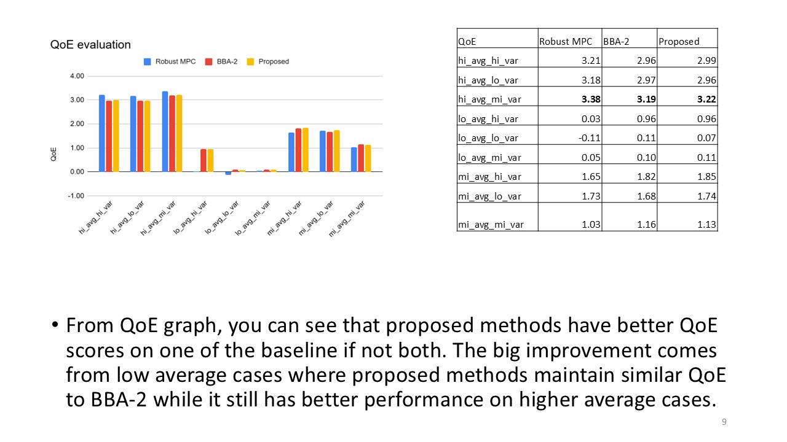
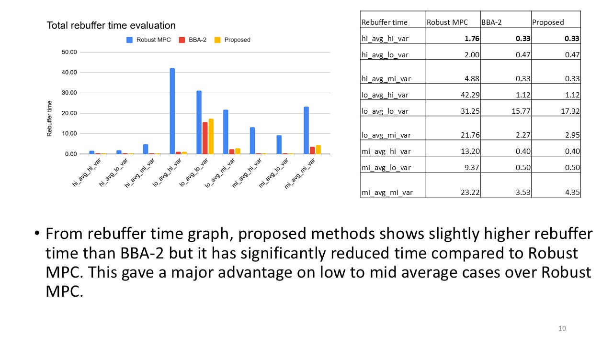

# ECE50863_Network

## Project2
Implemented a custom reliable transport protocol in Python to maximize goodput while minimizing overhead under diverse network conditions.
Designed and optimized sender/receiver logic beyond the baseline stop-and-wait scheme, improving throughput and efficiency.
Evaluated performance across multiple emulated network environments and documented trade-offs between reliability, latency, and overhead.
### Report

  
  
  
  
  
  
  
  
  
  
  
  
  
  
  
  

## Project3
Implemented and compared state-of-the-art ABR algorithms (RobustMPC and BBA-2) within a custom simulator.
Developed and tested algorithmic variants to improve streaming quality under high variability in bandwidth and latency.
Analyzed results across test cases, producing visualizations and research-style reports discussing QoE metrics, adaptation strategies, and performance trade-offs.

### Report

  
  
  
  
  
  
  
  
  
  
  
  
  

